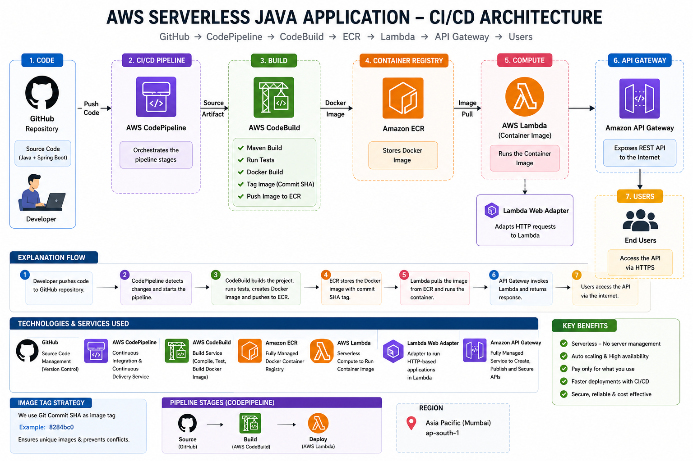

# Java Serverless API on AWS

A serverless Java Spring Boot REST API deployed on AWS using a complete CI/CD pipeline. The application is containerized with Docker, stored in Amazon ECR, executed using AWS Lambda (Container Image), and exposed through Amazon API Gateway.

---

## Project Explanation

This project demonstrates how to build and deploy a traditional Java Spring Boot REST API in a **serverless** way on AWS, without managing any servers.

Instead of running the Spring Boot app on a traditional EC2 instance or a dedicated server, the application is:

1. **Packaged as a Docker image** — the Spring Boot app is containerized using a `Dockerfile`, so it runs consistently across environments.
2. **Stored in Amazon ECR** — the built Docker image is pushed to a private container registry (Elastic Container Registry) instead of Docker Hub.
3. **Executed via AWS Lambda (Container Image support)** — instead of a normal Lambda ZIP deployment, Lambda pulls and runs the Docker image directly, letting a full Spring Boot app run inside a Lambda function.
4. **Exposed through Amazon API Gateway** — API Gateway sits in front of Lambda and turns it into a public REST API endpoint that any client (browser, Postman, mobile app) can call over HTTPS.
5. **Automated with a CI/CD pipeline** — every time code is pushed to GitHub, AWS CodePipeline automatically triggers CodeBuild to compile the code, run tests, build the Docker image, push it to ECR, and update the Lambda function — with zero manual deployment steps.

**In short:** you write normal Java/Spring Boot code, push it to GitHub, and AWS automatically builds, containerizes, and deploys it as a fully serverless, auto-scaling REST API — with no servers to provision or maintain.

This pattern is useful when you want the familiarity of Spring Boot development but the cost efficiency, scalability, and zero-maintenance benefits of serverless infrastructure.

---

## Project Architecture



---

## Architecture Workflow

1. Developer pushes source code to GitHub.
2. AWS CodePipeline detects the code change through AWS CodeConnections.
3. AWS CodeBuild compiles the project, runs tests, builds a Docker image, and pushes it to Amazon ECR.
4. Amazon ECR stores the Docker container image.
5. AWS Lambda deploys the latest container image from Amazon ECR.
6. Amazon API Gateway exposes the Lambda function as an HTTP REST API.
7. End users access the application through the API Gateway endpoint.

---

## Technology Stack

- Java 21
- Spring Boot 3.x
- Maven
- Docker
- Git & GitHub
- AWS CodeConnections
- AWS CodePipeline
- AWS CodeBuild
- Amazon Elastic Container Registry (ECR)
- AWS Lambda (Container Image)
- Amazon API Gateway

---

## Project Structure

```
java-serverless-api/
│
├── docs/
│   └── screenshots/
│       ├── 01-Local API Response (Version 1).png
│       ├── 02-IAM Roles Configuration.png
│       ├── 03-AWS CodeBuild Project.png
│       ├── 04-CodeBuild Successful Build.png
│       ├── 05-Amazon ECR Private Repository.png
│       ├── 06-Docker Images in Amazon ECR.png
│       ├── 07-AWS Lambda Function Deployment.png
│       ├── 08-AWS CodePipeline Execution.png
│       ├── 09-AWS CodeConnections (GitHub Integration).png
│       ├── 10-Amazon API Gateway Configuration.png
│       └── 11-architecture-diagram.png
│
├── src/
│   └── main/
│       ├── java/
│       │   └── com/
│       │       └── example/
│       │           └── api/
│       └── resources/
│           └── static/
│
├── Dockerfile
├── buildspec.yml
├── pom.xml
└── README.md
```

> Note: the `target/` folder (Maven build output) is excluded above since it's auto-generated and shouldn't be committed — add it to `.gitignore`.

---

## Local Development

Clone the repository.

```bash
git clone https://github.com/Annsabsn/java-serverless-api.git

cd java-serverless-api
```

Run the application.

```bash
mvn spring-boot:run
```

API Endpoint

```
http://localhost:8081/hello
```

Expected Output

```json
{
  "message": "Hello from Java Backend Version 1"
}
```

---

## Docker Build

Build Docker Image

```bash
docker build -t java-api .
```

Run Docker Container

```bash
docker run -p 8080:8080 java-api
```

---

## CI/CD Pipeline

### Source

GitHub Repository

↓

### Continuous Integration

AWS CodePipeline

↓

AWS CodeBuild

↓

Docker Image Build

↓

Push Image to Amazon ECR

↓

### Continuous Deployment

AWS Lambda (Container Image)

↓

Amazon API Gateway

↓

REST API

---

## AWS Services Used

| Service | Purpose |
|----------|---------|
| GitHub | Source Code Management |
| AWS CodeConnections | Connect GitHub to AWS |
| AWS CodePipeline | CI/CD Pipeline |
| AWS CodeBuild | Build Java Project & Docker Image |
| Amazon ECR | Store Docker Images |
| AWS Lambda | Run Container Image |
| Amazon API Gateway | Expose REST API |

---

## Project Screenshots

| # | Screenshot | Description |
|---|------------|-------------|
| 01 |  | Local API Response |
| 02 |  | IAM Roles Configuration |
| 03 |  | AWS CodeBuild Project |
| 04 |  | CodeBuild Successful Build |
| 05 |  | Amazon ECR Private Repository |
| 06 |  | Docker Images in Amazon ECR |
| 07 |  | AWS Lambda Function Deployment |
| 08 |  | AWS CodePipeline Execution |
| 09 |  | AWS CodeConnections (GitHub Integration) |
| 10 |  | Amazon API Gateway Configuration |
| 11 |  | System Architecture Diagram |

---

## Features

- Serverless Java Application
- Docker Container Deployment
- Automated CI/CD Pipeline
- REST API using Spring Boot
- Amazon ECR Image Repository
- AWS Lambda Container Deployment
- Secure API Gateway Endpoint
- Fully Automated Build and Deployment

---

## Future Enhancements

- Authentication using Amazon Cognito
- Terraform Infrastructure as Code
- CloudWatch Monitoring
- AWS X-Ray Tracing
- Automated Testing Pipeline
- Blue/Green Deployment

---

## Author

**Annasab Nandaganv**

Java | AWS Cloud | DevOps | Docker | CI/CD | Serverless
